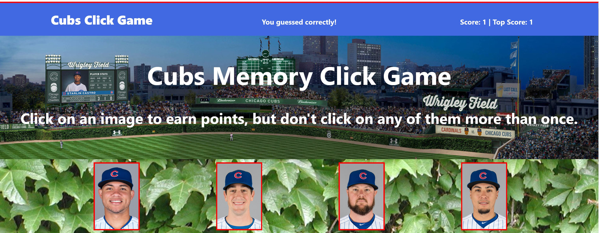

# **Chicago Cubs Memory Game**

### This app will test your knowledge of the some of the players from the Chicago Cubs roster for the year 2019 as well as your memory. The object of the game is to consecutively click on a different player displayed until you have guess all the player without repeating yourself.

## How to Play

* To start the game simply click on player's picture.

* Notice that your score as well as the top score have increased by 1.

*  As you continue to guess players correctly, by choosing without repeating, your score as well as the top score will continue to increase by 1. 

* If you click on the same player twice in the same round your score will fall to 0 and the top score will remain on the highest score to date during the duration of playing the game until someone beats it.

* To start the next round simply click on a player's picture once again and try and beat the top score
* You win the game when you have guessed all the players wihtout repeating yourself.

### Good Luck! Have Fun!

[Link to site](https://chiago-cubs-memory-game.netlify.com/)